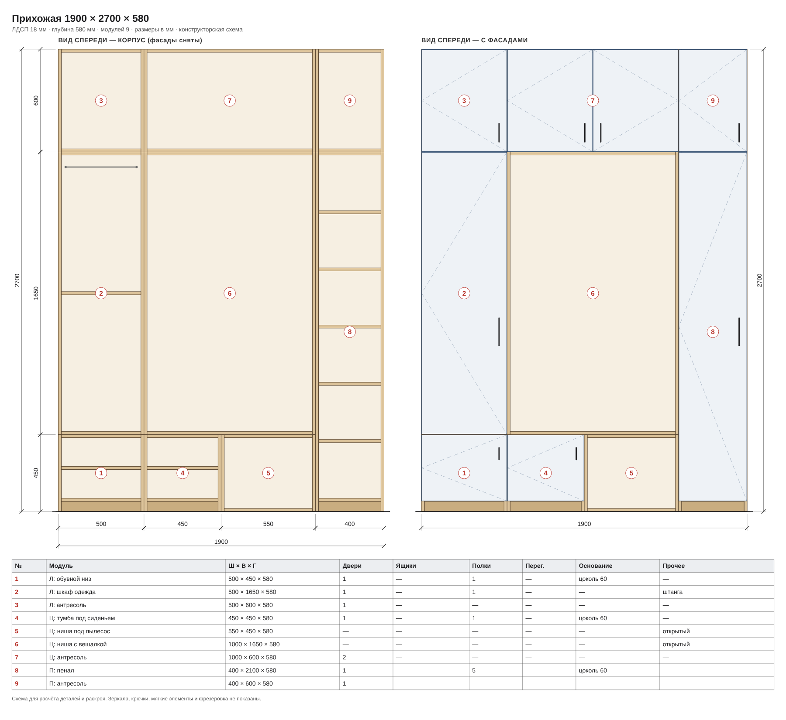

# Furniture Detailing

A small web app for cabinet furniture made from laminated chipboard (LDSP). Upload a photo or sketch of a piece and its overall size. Claude breaks it into buildable carcass modules and places them in the assembly. The app then produces:

- **Assembly drawing**: a technical elevation rendered by the backend as SVG, downloadable as PNG or SVG. It shows:
  - the carcass with fronts removed (panels at real thickness, shelves, partitions, drawer boxes, rail);
  - the same front with doors, opening marks, handles and drawer fronts;
  - dimension chains along every module boundary;
  - a spec table for each module.
- **Module drawings**: a front view of each module on its own.
- **Cut list**: every panel with size, material, grain direction and edge banding.
- **Sheet nesting**: guillotine cutting maps for each sheet with kerf, edge trim and grain lock, plus the sheet count.
- **Hardware**: hinges, drawer slides, handles, legs, confirmat screws, shelf pins and screws.
- **Estimate**: prices from [domus.am](https://domus.am) (Yerevan), including the store's per-piece cutting service. Prices are editable.

```
photo + W×H×D ──► Java backend ──► Anthropic Messages API (vision)
                                       │
                 normalized JSON ◄─────┘
                       │
                       ▼
     assembly drawing (SVG/PNG) · cut list · nesting · hardware · estimate
```



## Using it

1. **Фото и размеры.** Upload up to 3 photos, renders or hand sketches, then enter the overall width, height and depth plus any wishes. Click «Рассчитать по фото».
2. **Чертёж сборки.** Claude's reading of the photo appears together with the drawing. «Скачать PNG / SVG» saves the drawing. «Вернуть прежний проект» undoes the import.
3. **Детали, раскрой и смета.** Edit any module, including its position X/Y. The drawing, cut list, sheet maps, hardware and estimate recalculate as you type.

## Run

You need Java 21+, Maven, and an **Anthropic API key** from [console.anthropic.com](https://console.anthropic.com). A claude.ai subscription does not give API access. API usage is billed separately.

```bash
mvn package
export ANTHROPIC_API_KEY=sk-ant-...
java -jar target/furniture-detailing.jar
# open http://127.0.0.1:8080
```

On Windows use `set ANTHROPIC_API_KEY=...`, or run `run.bat`.

| Variable | Default | Meaning |
|---|---|---|
| `ANTHROPIC_API_KEY` | — | Required for photo analysis. Without it the UI still works with manual or pasted JSON. |
| `CLAUDE_MODEL` | `claude-sonnet-5-5` | Any vision-capable Claude model, e.g. `claude-opus-5-5` for harder pieces. |
| `PORT` / `HOST` | `8080` / `127.0.0.1` | Set `HOST=0.0.0.0` to open the app from a phone on the same Wi-Fi. |
| `CLAUDE_MAX_TOKENS` | `4000` | Answer size limit. |
| `CLAUDE_TIMEOUT_SECONDS` | `120` | Request timeout. |

With Docker:

```bash
docker build -t furniture-detailing .
docker run -p 8080:8080 -e ANTHROPIC_API_KEY=sk-ant-... furniture-detailing
```

## API

| Method | Path | Body | Returns |
|---|---|---|---|
| `GET` | `/api/status` | — | `{claudeConfigured, model, maxImages}` |
| `POST` | `/api/analyze` | `{width, height, depth, notes, thickness, images:[{mediaType, data(base64)}]}` | proposal |
| `POST` | `/api/proposal/normalize` | any text containing proposal JSON | proposal |
| `POST` | `/api/drawing` | `{modules:[ModuleSpec], thickness, title}` | assembly drawing, `image/svg+xml` |

`/api/analyze` returns the proposal plus `drawingSvg`, so one call goes from photo to drawing.

A proposal looks like `{summary, modules:[ModuleSpec], notes:[...]}`. Every module is clamped to values the engine can build: unknown types fall back to `wardrobe`, door counts are capped and missing fields are filled from the type preset. Bad model output therefore never breaks the calculation.

`ModuleSpec` is one carcass with `type` (wardrobe | dresser | kitchenLow | kitchenUp | rack | tumba), size `W/H/D`, `doors`, `drawers` with height `dh`, `partitions`, `shelves` per section, `top` (solid | rails), `base` (none | legs | plinth), the flags `rod`, `back`, `hang`, and its position `x` (mm from the left edge) and `y` (mm from the floor).

When Claude, or a hand-added module, gives no position, `Layout` places it automatically:
- modules named «Л: / Ц: / П: …» (left, centre, right) form one column per zone, filled bottom-up in rows, so two small cabinets can sit side by side under a tall one;
- unnamed modules stand side by side.

## Layout

```
src/main/java/am/furnituredetailing/
  FurnitureDetailingApp.java                 entry point, env config
  claude/AnthropicClaudeClient    POST /v1/messages with base64 image blocks (JDK HttpClient)
  design/FurniturePrompt          instruction that maps a photo onto the module model
  design/DesignService            validation → Claude → JSON extraction → normalization
  design/ModuleSpec               module record + clamping/defaults
  design/Layout                   positions modules in the assembly
  drawing/AssemblyDrawing         SVG elevation: carcass + facade views, dimension chains, spec table
  web/ApiServer                   JDK HttpServer on virtual threads: UI + JSON API
src/main/resources/static/index.html   constructor UI and calculation engine
```

The calculation engine (cut list, guillotine nesting, hardware rules) currently runs in the browser. Porting it to Java behind `/api/calculate` is the natural next step.

## Tests

```bash
mvn test
```

The tests cover:
- JSON extraction;
- the Anthropic client against a local stub of `/v1/messages`;
- auto-layout;
- the SVG drawing;
- full HTTP round trips with a fake Claude.

## Limits of the model

- Drawers stack at the bottom across the full width, with equal doors above them.
- Each module is a separate carcass, so neighbouring modules have double side panels.
- The back panel is fibreboard (DVP) nailed on.
- Mirrors, hooks, cushions and milled grilles are not calculated.
- Hardware without a domus.am listing has estimated prices, marked «уточнить» (to verify).
